# 🚀 자바프로그래밍 시작하기
### 📃 진행 순서
①  자바 개발 환경 설정하기    <br>
②  이클립스 환경 세팅   <br>
③  HelloJava 실습   <br>

## ⛏️ 자바 개발 환경 설정하기 
### ⚙️ 자바(jdk17) 설치하기
`JDK`는 **Java Development Kit**의 줄임말로, 자바 프로그램을 개발하는데 필요한 라이브러리와 플랫폼이 포함되어 있다.   <br>
→  구현된 자바 프로그램을 실행하기 위해서는 자바 실행 환경만 있으면 실행이  된다. 
> 🔩 `자바 실행 환경` : JRE, Java Runtime Environment
<br>

**프로그램을 만들기(개발하기) 위해서는 JDK가 설치되어야 한다.**
> 🔩 `JDK 17버전` 설치 <br>
> 💡 JDK 설치 사이트 ([click here](https://www.oracle.com/java/technologies/javase/jdk17-archive-downloads.html))<br>
> 🪄 Windows x64 Installer 설치 ([click here](https://download.oracle.com/java/17/archive/jdk-17.0.12_windows-x64_bin.exe))   <br><br>
> 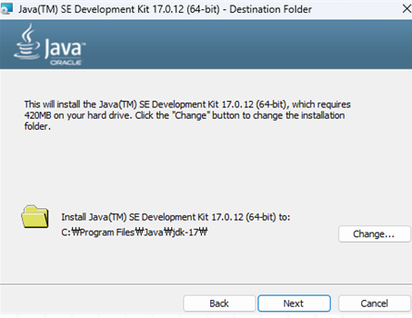   <br><br>
> →  기본 설정 그대로 둔 채로 next 눌러 설치  <br>
<br>

### ⚙️ JDK 설치 버전 확인  <br>
`javac –version` 명령어를 통해 자바 버전이 잘 적용되었는지 확인. <br><br>
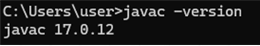   <br>
<br>
---
<br>

### ⚙️ 환경 변수 세팅하기 
① `시스템 환경 변수 편집` – `고급` - `환경 변수` 클릭   <br><br>
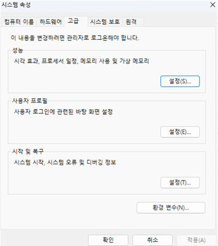   <br>
<br>

②  `시스템 변수(S)` - `새로 만들기` – `새 시스템 변수`   <br><br>
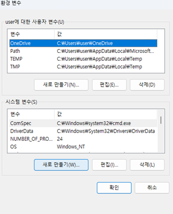   <br>

> `변수 이름` :　JAVA_HOME <br>
> `변수 값` :　C:\Program Files\Java\jdk-17 <br><br>
> 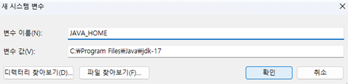   <br>
<br>

③ `시스템 변수(S)` - `Path` - `편집` – `새로 만들기` - `%JAVA_HOME%\bin` 생성 (맨위로 이동)<br><br>
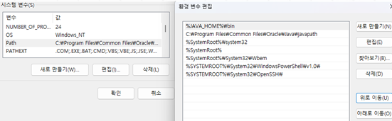   <br>

<br>
---
<br>

### ⚙️ eclipse 설치하기 (22년도 06월 버전)
하단의 설치 사이트에 접속하여, `Eclipse IDE for Enterprise Java and Web Developers` | `windows x86_64` 버전을 설치한다.  <br>
https://www.eclipse.org/downloads/packages/release/2022-06/r   <br><br>
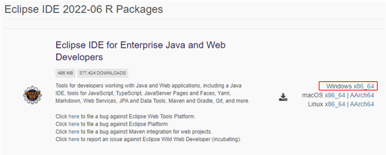   <br>
<br>

🔩 **eclipse 화면 창 구성**  <br><br>
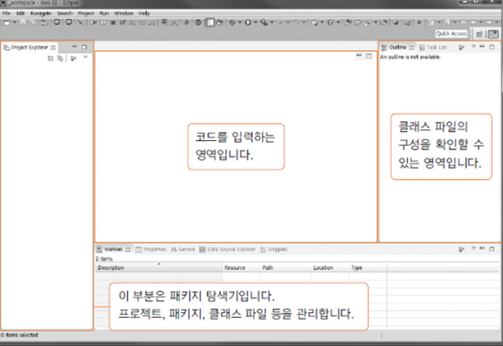   <br>
<br>

🔩 **이클립스 IDE 자바 전용 환경으로 설정**  <br>
다운로드 받은 이클립스 환경이 Java 전용 환경이 아니므로, ***우측 상단의 +아이콘을 눌러, `open perspective` 창을 연 후, Java를 누르고 open을 클릭***한다.  <br><br>
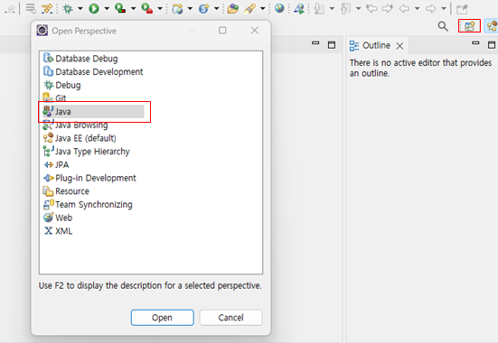   <br>
<br>

🕹️ **eclipse 환경 추가 설정**  <br>
✒️ ***메모리 줄이기***  <br>
`Windows` – `Preferences` – `General`  - `Show heap status`  체크 활성화 <br><br>
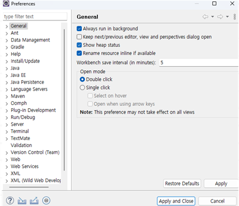   <br>
<br>

✒️ ***ISO 10646/Unicode(UTF-8)로 설정 변경***  <br>
**검색창에 encoding을 입력**하여 CSS Files, HTML Files, JSP Files, XML Files 모두 `ISO 10646/Unicode(UTF-8)`로 변경한다. <br><br>
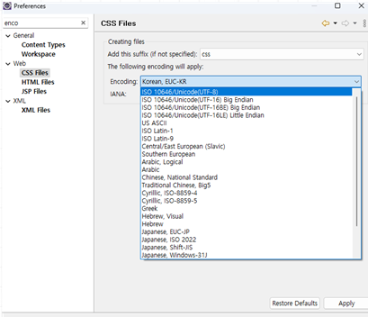   <br>
<br>

## ⛏️ HelloJava.java 실습 
### 🎲 Java Project 생성하기
`File` – `new` – `Java Project` - `java_study`로 프로젝트명을 생성한다. <br><br>
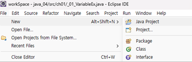   <br><br>
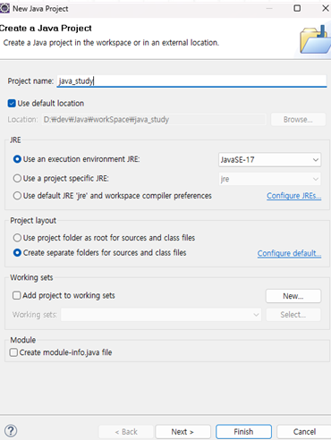   <br><br>
> 🎯 JRE를 `JavaSE-17`로 설정하여 생성한다.    <br>
> 🎯 Create module-info.java는 `don’t create`하여 생성한다.    <br>
---
<br>

### 🎲 패키지 생성 
자바 프로그램은 모두 **클래스 기반으로 구성**된다. *클래스를 생성하기 위해서는* 먼저 `Package`를 만들어야 한다. <br>
`src` – `New` - `Package`  <br><br>
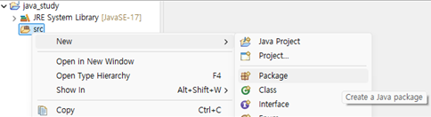   <br><br>
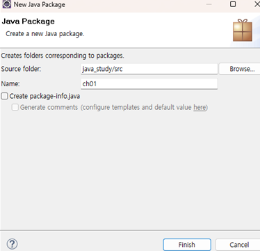   <br><br>
> 🎱 `Package` : 프로그램 소스의 묶음 <br>
> 🎯 `Source folder` : 패키지 생성 경로 <br>
> 🎯 `Name`  : ch01로 설정한다. (패키지 명은 항상 **소문자**로 작성한다.) <br>
---
<br>

### 🎲 클래스 생성 
클래스(class)란 **객체를 소스 코드로 나타낸 것**을 말한다. <br>
`ch01`(패키지 우클릭) - `New` – `Class` <br>
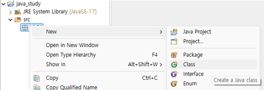   <br><br>
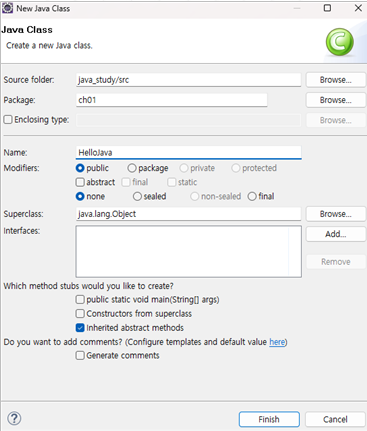   <br><br>
> 🎯 `class Name` : HelloJava로 설정.(패키지 명은 항상 **대문자**로 작성한다.) <br>
---
<br>

### 🎮 HelloJava.java 코드 
아래 실습 코드를 작성한다. 
```java
package ch01;     // package : 프로그램 소스들을 묶은 것

//HelloJava class 생성, class 명은 첫문자 대문자로 시작한다. 
public class HelloJava {
  /* main 함수(메서드) 생성 | 소문자로 시작한다.
	* String : 문자열을 관리하는 함수 */
  public static void main(String[] args) { 
    /* println : 화면에 출력
     * System.in : 콘솔에서 데이터를 입력받을 때 사용 
     * System.out : 콘솔에서 데이터를 출력할 때 사용 */
    System.out.println("Hello, Java");  // ; : 문장의 마침표 역할 
  }
}
```
> 🎯**프로그램 실행하기**<br><br>
>    <br><br>
> 메뉴의 초록색 화살표를 누르면 프로그램을 실행할 수 있다. (ctrl + f11) <br><br>
> 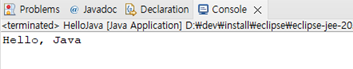   <br>